  

  

  

  

 

  

## ⚡ Tech Stack

**⚙️ Languages & Frameworks**

**🗄️ Database · ☁️ DevOps · 🛠️ Tools**

  

## 🛰️ Microservices in Motion

  

  

## 📊 Dev Stats — real data (public + private), refreshed nightly

  

  

## 🤝 ติดต่อผม

  
  

  

